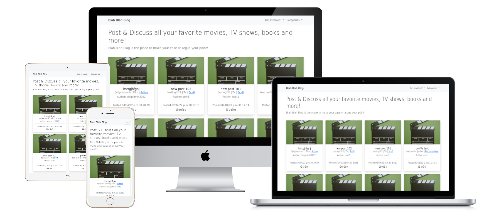

# Blah Blah Blog

- [Live Website](https://blah-blah-blog-2022.herokuapp.com/)
- [Github Repository](https://github.com/jenns93/blah-blah-blog)
 # About
A place to make your case for what you think are the best Films / Tv Shows & Books!

## Table of Contents

- [User Experience UX](#User-Experience-UX)

- [Design](#Design)

- [Wireframes](#Wireframes)

- [Features](#Features)

- [Technologies Used](#Technologies-Used)

- [Testing](#Testing)

- [Deployment](#Deployment)

- [Bugs](#Bugs)

- [Credits](#Credits)

## User Experience UX
### User Stories

i. As a Site Admin I can make draft posts so that I complete content at another time.

ii. As a Site Admin I can create, read, update and delete posts so that I can manage the blog feed.

iii. As a Site User I can Like and unlike posts so that I can interact with the content.

iv. As a Site User I can post comments so that I can get involved with the discussion.

v. As a Site User I can create an account so that I can comment and like.

vi. As a Site User/Admin I can View comments on a post so that I can follow the conversation.

vii. As a Site User/Admin I can View the amount of likes on each post so that I can see the popularity of each post.

viii. As a Site user I can click on a post so that I can read the whole post.

ix. As a Site User I can View a list of posts so that I can select the one I wish to view.

x. As a Site User I can View a paginated list of posts so that I can select posts to view easily.

xi. As a site user I can have to option to edit my posts so that I can alter or add to my posts when I want.

xii. As a site user I can have to option to create my own posts so that I can post blogs for others to read.

xiii. As a site user I can have a delete option on my profile page so that I can choose which of my posts I want to remove

xiv. As a site user I can access my profile page so that I can access posts I have made.

xv. As a site user I can filter posts by category so that I can read posts about my favourite genre.

## Design

### Colour Scheme
- Colour scheme is white / grey / black for a modern feel.
### Imagery
- Classic movie click boards are used for place holder post images.
- Popcorn is used as place holder for post details.
- user can upload own images to reflect what the post is about.

## Wireframes
- The wireframes were created using [Mockplus](https://www.mockplus.com/)

### Home Page
[Home](media/images/blog-home-wireframe.jpg)
### Profile page
[Profile](media/images/blog-profile-wireframe.jpg)
### Post Detail
[Post detail](media/images/blog-post-detail-wireframe.jpg)
### Login / Sign up
[Login/Signup](media/images/blog-login-sign-up-wireframes.jpg)
### Logout
[Logout](media/images/blog-logout-wireframe.jpg)
### Create Blog post
[Create post](media/images/blog-create-blog-wireframe.jpg)

## Features
### Home
- All users will view the home page with a full paginated list of available posts that registered users have made.
- Users have drop down menus for getting involved with the site, with relative links such as: log in/sign up (for new & returning users), log out/blog post form (for registered users).
- Users also have another dropdown menu for filtering posts by available genres.  

### Sign Up
- Users will be prompted to create an account by filling in a short form.
- Users will be required to provide an email address, full name, and password.
- When the form is completed, users can select "Submit" where they will be redirected to the home screen allowing them to now like / dislike and comment on posts.
- A notification bar will appear on home page briefly to confirm Sign up successful.
- An email will be sent to user as confirmation of creating their account.
 
### Login
- Users will be asked to provide their email and account password.
- When required fields are completed the user can select "login" to gain access to their profile and begin using the full amenities of the website and will be redirected to the home page.
- A notification bar will appear on home page briefly to confirm login.
 
###Log Out
- Users will be asked if they are sure they would like to "Log Out" once before logging out is completed and will then be redirected to the home page.
- A notification bar will appear on home page briefly to confirm logout.

### Profile
- Users can view their profile which displays their details and list of posts created.
- Users have the option to edit any of their posts by selecting the edit button. They will then be taken to the edit form.
- Users can select the delete button on their posts, where they will be taken to the delete confirmation page.

### Creating Posts
- From the homepage registered users will have the option to complete the blog post form.
- Users will name the post, select the media type, enter the subject's title, and write their post / opinion they wish to put forward.
- Once all fields are completed and the user is happy, they can publish their post or save as draft where they can publish later.

### Editing Posts
- By selecting edit on the user's profile page on the desired post, they will be transferred to the edit form.
- The edit form will display all the data from the selected post that can be edited.
- Once the user is happy with the changes to their post, they will press the confirmation of edit button, they will then be returned to their profile page.

### Deleting Posts
- By selecting delete on the user's profile page on the desired post, they will be transferred to the delete confirmation page.
- This page will give the user a final chance to not delete the post and return to their profile page by selecting back.
- If the user is happy to delete their post, they will press the delete button which will return them to their profile page.

 ### Commenting
- Registered users when viewing a full post will have the option to fill out the comment form and submit their thoughts on the post to discuss with other users.
- Once their comment is submitted the users will be notified that their comment was successfully posted.
- The users comment will now be visible to other site users and will be added to the string of comments below the original comment. 

### Like / Dislike
- Registered users will have the ability to Like / Dislike posts.
- Registered users can only vote to Like or Dislike a post not both. ( Users can change their mind anytime and choose the opposite option)
- Totals of Likes & Dislike will be displayed next to their respected icons. (Counts will also be displayed on homepage list of posts)

### Categories
- Users will be presented with a category dropdown menu with all available genres to filter by.
- Users can also select the displayed genre on an individual post to filter shown posts by the desired genre.

### Footer
- Footer displays all available social links at the base of all pages.
- Selecting these links will take the users to the desired site in a new browser tab.

### Future Features
- Email users when someone has commented on their post.
- Email users when milestone likes are achieved e.g., 100, 500, 1,000 etc.
- Notify users when their post has been flagged for review.
- Favourite button to allow users to bookmark their favourite posts.
- Most liked post of the month, highlighting the most popular posts.
- Option to follow another user to be notified when they publish a new post.
- List of top contributors of the site e.g. Most post likes, most followed.

## Technologies Used

### Languages Used

- Python
- JavaScript
- Django
- HTML
- CSS

### Frameworks, libraries, and programs used

- [Heroku](https://dashboard.heroku.com/apps) Heroku was used to host the files and to publish the finished program.
- [Django](https://www.djangoproject.com/) Django was used to develop this site with its built in framework.
- [Gitpod](https://www.gitpod.io/) Gitpod was used to code the website and commit changes throughout the development to Github.
- [Bootstrap](https://getbootstrap.com/) Bootstrap was used for structuring the design of html templates.
- [Cloudinary](https://cloudinary.com/) Cloudinary was used to store the static images & files.
- [PostgreSQL](https://www.postgresql.org/) PostgreSQL was used as the database with Heroku.
- [Mockplus](https://www.mockplus.com/) Mockplus was used to create the wireframes for this site.

## Testing

### Functionality Testing

i. Navigation bar
- Tested that all links within "get involved" dropdown menu take user to relevant site locations.
- Tested that all links for "categories" dropdown menu take user to posts of the desired genre.
- Tested that all links change colour when hovered over.
- Tested that "blah blah blog" title will return users to home page.
- Tested that links only relevant to the users sign in status are visible. e.g., sign up/sign in for new/returning users & logout/blog post form for account holding users.

ii. Authorisation pages
- Tested that sign in/ sign up pages will only proceed if all required information fields have been completed.
- Tested that authorisation confirm buttons work and return the user back to the home page with the relevant status changes logged in/out.
- Tested that log out page displays to confirm that the user is positive that they wish to logout.

iii. Posts
- Tested that all created posts that have NOT uploaded a custom image for their post are replaced with a placeholder image.
- Tested that all created posts display relevant information. e.g., genre/title/author.
- Tested that all posts display time stamp of creation.
- Tested that all posts display current like/dislike count. 

iv. Profile
- Tested that all user's created posts are displayed with relevant information about post.
- Tested that all user's created posts are displayed with edit & delete links and that link forward onto relevant page.
- Tested that all user's created posts take the user to the full post.
- Tested that all user's created posts are displayed with counts for likes/dislikes.

v. Post detail
- Tested that posts when viewed fully display the whole post content with details as well as time stamp & author.
- Tested that all posts display like/dislike buttons to cast a vote with total likes/dislikes count beside it.
- Tested that all posts only allow logged in users to cast a vote on posts.
- Tested that all posts like/dislike buttons only allow the user to vote for one option or the other.
- Tested that posts display comments below post with comments listed in date order.
- Tested that posts only display comment form if user is logged in.

vi. Blog post form
- Test that link to blog post form is only available to logged in users.
- Test that form fields are satisfied before form can submit.
- Test that form shows user's username is displayed on form.

vii. Edit post form
- Test that edit form displays the current information present in the post.
- Test that all form fields must still be satisfied to submit form.
- Test that once edited for has changed to the new information

viii. Delete post
- Test that when delete link is selected that users are taken to delete confirmation page.
- Test that delete link is only available via user's profile and only on posts that belong to them.
- Test that users have the option to return to their profile from the delete confirmation page.
- Test that once users have confirmed that they wish to delete post and returned to profile page that the post has been deleted.
- 
#### Browser Compatibility
| Device      | Safari            |  Microsoft Edge    | Chrome                       
| ----------- | -----------       | -----------        | -----------                
| Desktop     | Not Tested        |:heavy_check_mark:  |:heavy_check_mark:  
| Tablet      | :heavy_check_mark:|:heavy_check_mark:  |:heavy_check_mark:  
| Mobile      | Not Tested        |:heavy_check_mark:  |:heavy_check_mark:  

- Devices used in this testing include: Dell desktop PC, Asus laptop and various android smart phones.
- In addition the site has been tested on the selection of device screen sizes provided in [Chrome DevTools](https://developer.chrome.com/docs/devtools/) such as : Galaxy S5, Iphone X and Ipad.  

### Testing User Stories
i. As a Site Admin I can make draft posts so that I complete content at another time.
1. Admin can save posts as either: Published or Draft, allowing for post completion later.

ii. As a Site Admin I can create, read, update, and delete posts so that I can manage the blog feed.
1. The Admin has options to create, update and delete any posts they wish along with ability to view all posts Published & Draft. 

iii. As a Site User I can Like and unlike posts so that I can interact with the content.
1. Registered Users once logged in have the ability to Like or Dislike any posts they wish. (1 choice per user per post)

iv. As a Site User I can post comments so that I can get involved with the discussion.
1. Registered Users once logged in have the ability to comment on any post as many times as they wish to allow the flow of the discussion.

v. As a Site User I can create an account so that I can comment and like.
1. Visitors have option to create an account to be eligible to use the full amenities of the website.

vi. As a Site User/Admin I can View comments on a post so that I can follow the conversation.
1. Visitors & Registered users can view comments on posts. However on registered users will have the ability to comment / like / dislike.

vii. As a Site User/Admin I can View the amount of likes on each post so that I can see the popularity of each post.
1. The counts of Likes & Dislikes are visible on the home page list of posts and on the post detail page.

viii. As a Site user I can click on a post so that I can read the whole post.
1. Visitors & Registered users can view full post by selecting them from the homepage where they are redirected to the full post.

ix. As a Site User I can View a list of posts so that I can select the one I wish to view.
1. Visitors & Registered users will be presented with a list of posts on the homepage they can view. 

x. As a Site User I can View a paginated list of posts so that I can select posts to view easily.
1. When multiple posts are available the homepage will paginate to allow for neat & compact view of site.

xi. As a site user I can have to option to edit my posts so that I can alter or add to my posts when I want.
1. Users that have signed in have the ability to edit their own posts from the "my profile" page where an edit link will be visible on all of users created posts.

xii. As a site user I can have to option to create my own posts so that I can post blogs for others to read.
1. Users that have signed in can access the blog post form from the nav bar dropdown menu, this will transfer the user to the form where they can create their own blog posts.

xiii. As a site user I can have a delete option on my profile page so that I can choose which of my posts I want to remove
1. Users that have signed in have the ability to delete their own posts from the "my profile" page where a delete link will be visible on all of users created posts.

xiv. As a site user I can access my profile page so that I can access posts I have made.
1. Users that have an account can access the "my profile" page from the nav bar dropdown menu, this will take them to the profile page where users will have the ability to view/edit or delete any of their posts.

xv. As a site user I can filter posts by category so that I can read posts about my favourite genre.
1. Users can view posts by genre by either selecting one of the available genres from the dropdown menu or by selecting the genre type on an individual posts.

## Deployment

### Github
- I created this repository by logging in to github.
- Selecting 'repositories' then 'new', I then selected the code institute template.
- Once my repository was named / created I selected the 'gitpod' button to open the new workspace in Gitpod to write my code.

### Heroku / Django
- Django framework install/set up process guided by [Code institutes Django Blog cheatsheet](https://codeinstitute.s3.amazonaws.com/fst/Django%20Blog%20Cheat%20Sheet%20v1.pdf)
- Once project was ready for deployment to heroku I linked to the github repository and manually deployed to heroku.

### Forking

- To fork sign into Github and go to [my repository] (https://github.com/jenns93/blah-blah-blog) and select the 'Fork' button and the fork will now be in your repositories.

### Cloning

- To clone sign into Github and go to [my repository](https://github.com/jenns93/blah-blah-blog) select the green ‘code’ button above the list of files.
- Then options for cloning are available: HTTPS, SSH & Github CLI.
- Then select the copy to clipboard icon to copy the URL.
- Open git bash and type 'git clone' and paste your copied URL and Press Enter.
- Further information is available in more detail [here](https://docs.github.com/en/repositories/creating-and-managing-repositories/cloning-a-repository).

## Bugs
### Solved Bugs
- Fixed slugfield issue when posting blog which was causing posts to be created without slug matching title.
### Remaining Bugs
- Summernote fields are not generating.
- Posts with the same title cannot co exist.

## Credits

#### Code

- Code institute walkthroughs.
- Stackoverflow for tips, examples concepts for further understanding of django framework.
- w3schools for tips, examples concepts for further understanding of language definitions.
- GeeksforGeeks for examples for understanding language better.
- [Django documentation](https://docs.djangoproject.com/en/4.0/) for guidance on how to use it's functionality.

#### Content

- Code written by the author - Jack Jenns
- To create the README file inspiration was taken from:
- Code Institute [SampleREADME](https://github.com/Code-Institute-Solutions/SampleREADME)
- Code Institute [README Template](https://github.com/Code-Institute-Solutions/readme-template)
- [Markdown cheat sheet](https://github.com/adam-p/markdown-here/wiki/Markdown-Cheatsheet)

### Acknowledgements
- Stackoverflow.
- Fellow students on slack.
- My mentor for his guidance.
- W3schools. 
- GeeksforGeeks

